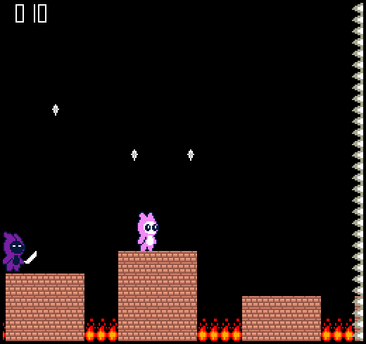

# Jump Guy

Author: Jianxiang Li, Hao Wang.

Design: Unlike most platformers game, this endless side-scrolling platformer game only enables player to control the strength of each jump using a single key press.

Screen Shot:

How Your Asset Pipeline Works:

The assets of this game are all png images (in `./source_png/` directory). There are three important vectors that we use to save and load the assets. The vector of palettes, vector of tiles, and vector of asset infos.

Png images are loaded and read through in a predefined order. The asset converter first go through all the pixels in the png and put them into a candidate palette. Then it checks with the palette table to find if there is a match, if not, push the palette to the palette table.
Then the converter converts the png's every 8\*8 block to a tile, and push it to the tile vector. Then we construct a asset info structure to store the corresponding width, height, tile ids and palette id for this specific png for retrieval.

The three vectors are then written into 3 `.chunk` files (in `./dist/data/` directory) by the converter program. And during the game runtime, the three chunks are loaded and tiles are rendered accordingly by applying PPU APIs.

To run the converter (in root directory of this game):

    ./dist/converter_runner ./source_png/

The all chuck files will be generated in `./dist/data/` directory.

How To Play:
* Jump from one platform to the other and avoid falling into fire.
* Don't get caught by the killer trailing you, and don't bump into the spikes on the right.
* Press the space key to charge the jump strength, the longer the key is pressed, the higher and further you jump.

Sources: 

`source_png/char_stand.png`, `source_png/char_crouch.png`, `source_png/char_jump.png`, `source_png/char_dead.png`, 
`source_png/killer.png`: modified from https://craftpix.net/freebies/free-pixel-art-tiny-hero-sprites/ (license: https://craftpix.net/file-licenses/)

`source_png/fire.png`: https://opengameart.org/content/fireflame. License: https://creativecommons.org/publicdomain/zero/1.0/

`source_png/brick.png`: modified from https://opengameart.org/content/mini-brick-tiles. License: https://creativecommons.org/publicdomain/zero/1.0/

`source_png/spikedball.png`: modified from https://opengameart.org/content/spiked-ball-0.  License: https://creativecommons.org/publicdomain/zero/1.0/

This game was built with [NEST](NEST.md).
